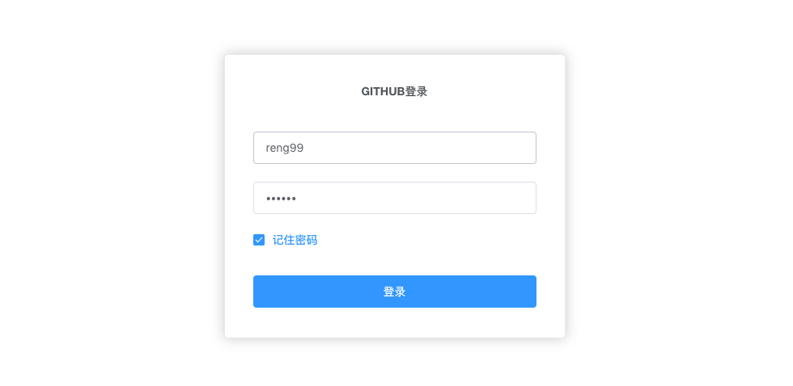

## github-admin



### 介绍

本仓库是使用vue和element-ui搭建的一个后台管理系统。目的是通过github提供的api展示个人（拥有github账号的人）的github活动等状况。线上效果请查看[http://reng99.cc/github-admin/](http://reng99.cc/github-admin/)。

### 怎么运行

```bash

# 进入目录
cd github-admin/core

# 安装依赖
npm install

# 开发环境 localhost:8082
npm run dev

# 生产环境
npm run build

# 注意：代码的提交请回到根目录提交更改后的代码，不然只是提交core目录下的代码而已
cd ..

```


