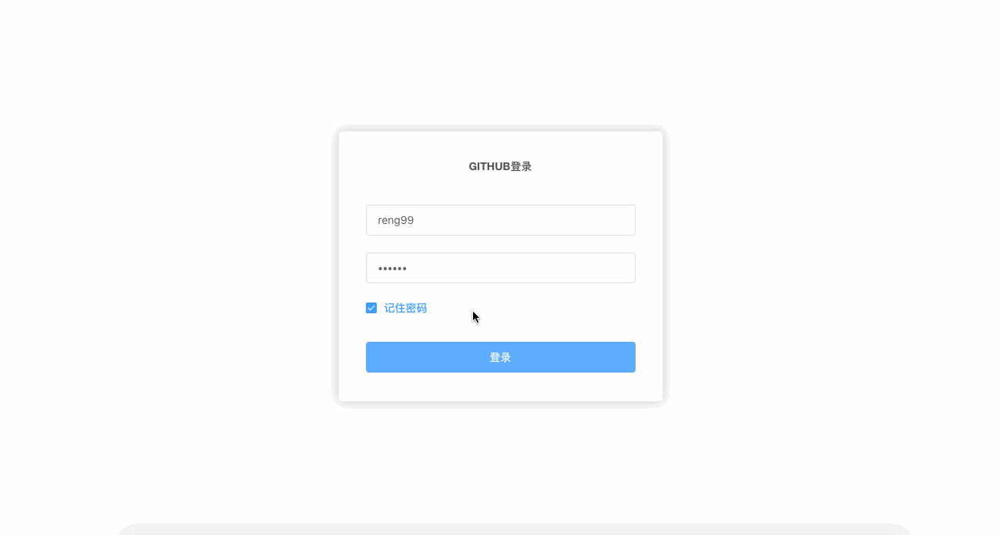

## github-admin

### 介绍

本仓库是使用vue和element-ui搭建的一个后台管理系统。目的是通过github提供的api展示个人（拥有github账号的人）的github活动等状况。线上效果请查看[http://reng99.cc/github-admin/](http://reng99.cc/github-admin/)。目前在完善中...ps->已经完成的内容见`目前完成情况`。求小星星（star）😂

### 怎么运行

```bash

# 进入目录
cd github-admin/core

# 安装依赖
npm install

# 开发环境 localhost:8082
npm run dev

# 生产环境
npm run build

```

### 目前完成情况

- 个人主页

### 目前功能演示(动图)

登录功能，整个站点的布局，个人主页，退出登录



